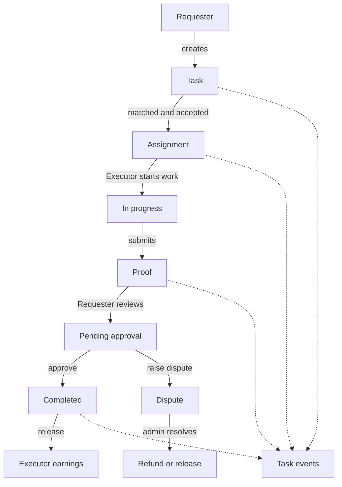
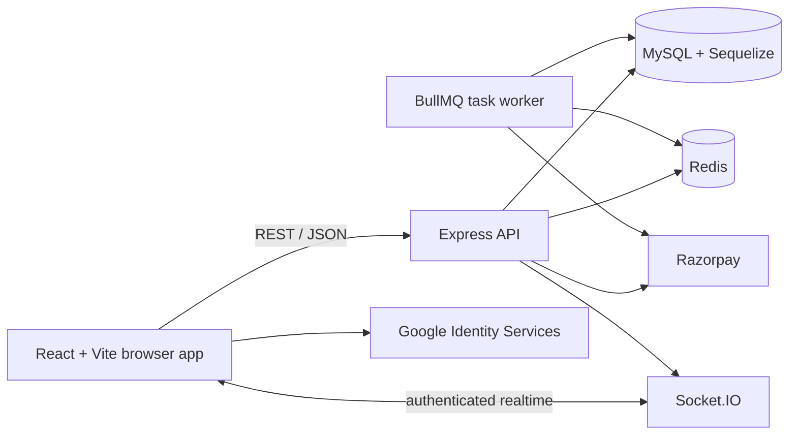

# HEREPHERI

HEREPHERI is a two-sided task marketplace for delegating local and digital work.
Requesters post tasks, Executors discover and accept suitable work, and both sides
follow a controlled workflow from assignment through proof, approval, dispute
handling, and payment settlement.

This repository contains the HEREPHERI API, background worker, database migrations,
and React web application.

## Product Flow



Supported task categories are `GO`, `GET`, `CHECK`, and `DIGITAL`. Tasks can be
`PHYSICAL`, `DIGITAL`, or `HYBRID`, with configurable risk, deadline, reward, and
proof requirements.

## Current Capabilities

### Requesters

- Register with email/password or Google Identity Services.
- Create and manage tasks with category, mode, location, deadline, reward, risk,
     currency, and proof type.
- View tasks and their current assignment, execution, payment, and review state.
- See ranked Executor matches based on marketplace signals and proximity.
- Fund an assigned task through Razorpay test or production credentials.
- Approve submitted work or raise a dispute.
- Receive notification and realtime task updates.

### Executors

- Create and manage an Executor profile.
- Set availability and update the current location.
- Discover nearby tasks by category and radius.
- Accept and release assignments.
- Start accepted work and submit text, file, photo, video, receipt, OTP, or
     document proof according to the task requirement.
- Track completed work and earnings.

### Administrators

- View marketplace overview metrics.
- Search users and suspend or reactivate non-admin accounts.
- Review and approve or reject identity verifications.
- Inspect open disputes and refund the requester or release payment to the
     Executor.

## Architecture



### Repository layout

```text
.
├── frontend/              React/Vite client
│   └── src/
│       ├── api/           Axios API client
│       ├── components/    layouts, routes, skeletons, toast, task UI
│       ├── context/       auth, mode, and Socket.IO providers
│       └── pages/         requester, Executor, and admin screens
├── migrations/            Sequelize database migrations
├── seeders/               Optional Sequelize seed data
└── src/
          ├── app.js             Express middleware and route registration
          ├── server.js          HTTP server, MySQL, Redis, and Socket.IO startup
          ├── config/             MySQL, Redis, queue, Google, and Razorpay config
          ├── controllers/        HTTP request/response adapters
          ├── middleware/         auth, CORS, security, rate limits, logging, errors
          ├── models/             Sequelize models and associations
          ├── routes/             API route modules
          ├── services/           business workflows and transactions
          ├── socket/             Socket.IO setup and task event emitters
          ├── validators/         request validation helpers
          └── workers/            asynchronous BullMQ workers
```

## Technology Stack

- Node.js with native ES modules
- Express 5
- React 19 and React Router
- Vite 8
- MySQL with Sequelize 6
- Redis with BullMQ for asynchronous jobs and Socket.IO Redis adapter
- Socket.IO for authenticated realtime updates
- JWT access and refresh tokens
- Google Auth Library and Google Identity Services
- Razorpay for payment orders, signature verification, refunds, and webhooks
- Helmet, CORS, and express-rate-limit for baseline API protection

## Prerequisites

Install or provision:

- Node.js 20 or newer
- npm
- MySQL 8 or a compatible MySQL server
- Redis 6 or newer
- A Google OAuth Web application client if Google sign-in is enabled
- Razorpay credentials if payment flows are enabled

Create the application database before running migrations. The database name,
host, port, and credentials are configured through environment variables.

## Installation

From the repository root:

```bash
npm install
cd frontend
npm install
cd ..
```

## Environment Configuration

Never commit real secrets. The backend reads `.env` from the repository root.
The frontend reads `.env.local` from `frontend/`; Vite exposes only variables
prefixed with `VITE_` to browser code.

### Backend `.env`

```dotenv
NODE_ENV=development
PORT=5000

DB_HOST=localhost
DB_PORT=3306
DB_NAME=herapheri
DB_USER=root
DB_PASSWORD=change-me

CLIENT_URL=http://localhost:5173

GOOGLE_CLIENT_ID=your-google-web-client-id

JWT_ACCESS_SECRET=replace-with-a-long-random-secret
JWT_REFRESH_SECRET=replace-with-a-different-long-random-secret
ACCESS_TOKEN_EXPIRES_IN=15m
REFRESH_TOKEN_EXPIRES_IN=7d

REDIS_URL=redis://localhost:6379

RAZORPAY_KEY_ID=your-razorpay-key-id
RAZORPAY_KEY_SECRET=your-razorpay-key-secret
RAZORPAY_WEBHOOK_SECRET=your-razorpay-webhook-secret
```

### Frontend `frontend/.env.local`

```dotenv
VITE_API_URL=http://localhost:5000/api/v1
VITE_GOOGLE_CLIENT_ID=your-google-web-client-id
VITE_SOCKET_URL=http://localhost:5000
```

`VITE_SOCKET_URL` should be the public origin of the Socket.IO server without
`/api/v1`. In production, set `VITE_API_URL`, `VITE_GOOGLE_CLIENT_ID`, and
`VITE_SOCKET_URL` in the frontend hosting provider before building.

### Google OAuth setup

In Google Cloud Console, configure the same Web application client ID in both
the backend and frontend environments:

1. Add the local frontend origin `http://localhost:5173` to Authorized
      JavaScript origins.
2. Add the production frontend origin, for example
      `https://your-frontend-domain.example`, to Authorized JavaScript origins.
3. Use the exact matching client ID in `GOOGLE_CLIENT_ID` and
      `VITE_GOOGLE_CLIENT_ID`.

## Database Migrations

Run migrations from the repository root:

```bash
npm run db:migrate
```

To undo the latest migration:

```bash
npm run db:migrate:undo
```

The migration history creates users, Executor profiles, tasks, assignments,
task events, proofs, disputes, payments, ledger entries, payment webhook event
records, refresh tokens, notifications, verifications, ratings, and supporting
indexes/status values.

## Running Locally

Start MySQL and Redis first. Run the API in one terminal:

```bash
npm run dev
```

Run the asynchronous worker in another terminal:

```bash
npm run worker
```

Run the Vite frontend in a third terminal:

```bash
cd frontend
npm run dev
```

The default local URLs are:

- Frontend: `http://localhost:5173`
- API: `http://localhost:5000`
- Health check: `http://localhost:5000/health`
- API base path: `http://localhost:5000/api/v1`

For a production-style frontend preview:

```bash
cd frontend
npm run build
npm run preview
```

## API Reference

All protected endpoints require:

```http
Authorization: Bearer <access-token>
```

The API returns JSON with a `success` flag, a human-readable `message` where
appropriate, and response data under `data` for successful operations.

### Authentication

| Method | Path | Purpose |
| --- | --- | --- |
| `POST` | `/api/v1/auth/register` | Create a local account |
| `POST` | `/api/v1/auth/login` | Authenticate with email and password |
| `POST` | `/api/v1/auth/google` | Authenticate with a Google ID token |
| `POST` | `/api/v1/auth/refresh` | Rotate/refresh an access token |
| `POST` | `/api/v1/auth/logout` | Revoke a refresh token |

### Users, profiles, and verification

| Method | Path | Purpose |
| --- | --- | --- |
| `GET` | `/api/v1/users/me` | Read the current user |
| `GET` | `/api/v1/executor-profile` | Read the current Executor profile |
| `POST` | `/api/v1/executor-profile` | Create an Executor profile |
| `PATCH` | `/api/v1/executor-profile` | Update an Executor profile |
| `PATCH` | `/api/v1/executor-profile/availability` | Toggle availability |
| `PATCH` | `/api/v1/executor-profile/location` | Update Executor location |
| `GET` | `/api/v1/verifications/me` | Read current verification status |
| `POST` | `/api/v1/verifications/me/start` | Start verification |

### Tasks and marketplace

| Method | Path | Purpose |
| --- | --- | --- |
| `POST` | `/api/v1/tasks` | Create a task |
| `GET` | `/api/v1/tasks/mine` | List requester tasks with filters/pagination |
| `GET` | `/api/v1/tasks/:taskId` | Read a task visible to the user |
| `PATCH` | `/api/v1/tasks/:taskId` | Update an eligible task |
| `POST` | `/api/v1/tasks/:taskId/cancel` | Cancel an eligible task |
| `GET` | `/api/v1/tasks/nearby` | Discover nearby tasks |
| `GET` | `/api/v1/matching/tasks/:taskId/candidates` | Get ranked Executor candidates |
| `POST` | `/api/v1/task-assignments/:taskId/accept` | Accept a task |
| `GET` | `/api/v1/task-assignments/mine` | List Executor assignments |
| `POST` | `/api/v1/task-assignments/:taskId/release` | Release an assignment |

### Execution, review, and payments

| Method | Path | Purpose |
| --- | --- | --- |
| `POST` | `/api/v1/tasks/:taskId/start` | Start assigned work |
| `POST` | `/api/v1/tasks/:taskId/proofs` | Submit task proof |
| `POST` | `/api/v1/tasks/:taskId/approve` | Approve submitted work |
| `POST` | `/api/v1/tasks/:taskId/disputes` | Raise a dispute |
| `POST` | `/api/v1/payments/tasks/:taskId/order` | Create a Razorpay order |
| `POST` | `/api/v1/payments/:paymentId/verify` | Verify a Razorpay payment |
| `POST` | `/api/v1/payments/webhook` | Receive Razorpay webhook events |
| `GET` | `/api/v1/earnings/mine` | Read Executor earnings |

### Notifications and ratings

| Method | Path | Purpose |
| --- | --- | --- |
| `GET` | `/api/v1/notifications` | List current user notifications |
| `PATCH` | `/api/v1/notifications/:notificationId/read` | Mark a notification read |
| `GET` | `/api/v1/ratings/me` | Read current reputation |
| `POST` | `/api/v1/ratings/tasks/:taskId` | Submit a task rating |

### Admin API

All admin routes require an authenticated user whose `role` is `ADMIN`.

| Method | Path | Purpose |
| --- | --- | --- |
| `GET` | `/api/v1/admin/overview` | Read platform metrics |
| `GET` | `/api/v1/admin/users` | Search and list users |
| `PATCH` | `/api/v1/admin/users/:userId/status` | Suspend or reactivate a user |
| `GET` | `/api/v1/admin/verifications` | List pending verifications |
| `GET` | `/api/v1/admin/disputes` | List disputes |
| `GET` | `/api/v1/admin/disputes/:disputeId` | Read one dispute |
| `POST` | `/api/v1/admin/disputes/:disputeId/resolve` | Refund or release a dispute |

## Authentication and Authorization

- Local login returns a short-lived access token and a refresh token.
- Refresh tokens are persisted as hashes and can be revoked on logout.
- API requests use the access token in the `Authorization` header.
- Suspended, banned, or deactivated accounts are rejected by authentication
     middleware.
- Admin endpoints use both authentication and the `ADMIN` role guard.
- Socket.IO connections authenticate with the access token during handshake and
     join a private `user:<id>` room.
- Google sign-in verifies the ID token audience against `GOOGLE_CLIENT_ID`.

## Realtime Events

The API emits `task:updated` to task participants after successful database
transactions. The payload includes `taskId`, `reason`, and `occurredAt`.

| Reason | User-facing meaning |
| --- | --- |
| `TASK_ASSIGNED` | Your task has been accepted. |
| `PAYMENT_HELD` | Task payment has been secured. |
| `TASK_STARTED` | The task has started. |
| `PROOF_SUBMITTED` | Work has been submitted for review. |
| `TASK_APPROVED` | Task completed and payment released. |
| `TASK_DISPUTED` | A dispute has been raised for this task. |
| `TASK_CANCELLED` | This task has been cancelled. |
| `TASK_RELEASED` | The Executor released the task. |
| `TASK_EXPIRED` | This task has expired. |

The frontend displays mapped task messages through the shared toast component.
Persisted notifications are also delivered through `notification:new` and remain
available through the notifications API.

## Payments and Financial State

Razorpay is used to create and verify payment orders. The application records
payment state, ledger entries, webhook events, and task events in MySQL.

Important payment states include:

`PENDING`, `AUTHORIZED`, `HELD`, `RELEASED`, `REFUND_REQUESTED`, `REFUNDED`,
`PARTIALLY_REFUNDED`, `FAILED`, and `DISPUTED`.

For production payments, configure Razorpay webhook delivery to the public
`/api/v1/payments/webhook` endpoint and use a strong `RAZORPAY_WEBHOOK_SECRET`.
The webhook route receives the raw JSON request body for signature validation.

## Security and Operations

Implemented baseline protections include:

- Helmet security headers.
- Explicit CORS allow-listing for configured and local frontend origins.
- General API rate limit of 300 requests per 15 minutes.
- Authentication rate limit of 20 requests per 15 minutes.
- Payment rate limit of 30 requests per 15 minutes.
- JWT access-token type validation.
- Account-status checks on authenticated requests.
- Admin role enforcement.
- Structured request context and request logging middleware.
- Refresh-token hashing and revocation.
- Redis-backed Socket.IO scaling and BullMQ jobs.

Before production launch, verify the following:

- All secrets are stored in the deployment secret manager, never in Git.
- `NODE_ENV=production` is set and production error responses do not expose
     stack traces.
- MySQL backups, retention, restore testing, and monitoring are configured.
- Redis is private, authenticated, encrypted in transit where supported, and
     monitored.
- TLS is enabled for the frontend, API, Socket.IO, and payment webhook URL.
- `CLIENT_URL` and Socket.IO CORS origins contain only trusted origins.
- Razorpay webhook signatures are tested with production credentials.
- Google OAuth origins exactly match deployed frontend origins.
- Database migrations run as an explicit release step.
- Worker processes are supervised and alert on failed jobs.
- Application logs, health checks, latency, error rates, queue depth, and payment
     reconciliation are monitored.
- Concurrent payment verification, duplicate webhook delivery, duplicate
     release, and refund retry behavior are tested in the target environment.

The `/health` endpoint confirms that the HTTP process is responding. It does not
by itself prove that MySQL, Redis, the worker, or external payment services are
healthy; production monitoring should check those dependencies separately.

## Testing and Quality Checks

The root package currently declares a test script, but its referenced
`src/test-risk-rules.js` file is not present in this checkout. Treat that script
as a pending test-suite configuration item until the test file or script is
restored.

```bash
npm test
```

Frontend lint and build commands:

```bash
cd frontend
npm run lint
npm run build
```

The repository also contains `src/test-assignment.js` for assignment-related
development checks. Run it only according to the current local test setup; it is
not exposed as an npm script.

At minimum, a release regression pass should cover:

- Local registration, local login, Google login, refresh, and logout.
- Requester task creation, matching, funding, review, approval, and dispute.
- Executor profile, discovery, acceptance, start, proof submission, and earnings.
- Admin overview, user status changes, verification decisions, and dispute
     resolution.
- Unauthorized, expired-token, suspended-account, empty-list, API-error, and
     retry states.
- Realtime toasts and persisted notifications for both task participants.
- Desktop and mobile layouts for every major workflow.

## Deployment Notes

The repository does not include a single provider-specific infrastructure
definition. Deploy the API and worker as separate Node processes, provision
MySQL and Redis, and deploy the Vite frontend as static assets or through a
frontend hosting provider.

### Backend release

```bash
npm ci
npm run db:migrate
npm start
```

Run the worker as a separate supervised process:

```bash
npm run worker
```

### Frontend release

```bash
cd frontend
npm ci
npm run build
```

Publish `frontend/dist` and configure the hosting provider to serve the SPA
entrypoint for client-side routes. Set all `VITE_*` variables before running the
build because Vite embeds them into the generated assets.

## Project Scripts

### Root scripts

| Command | Description |
| --- | --- |
| `npm run dev` | Start the backend with Nodemon |
| `npm start` | Start the backend with Node |
| `npm run worker` | Start the BullMQ task worker |
| `npm test` | Run the configured backend test script |
| `npm run db:migrate` | Apply Sequelize migrations |
| `npm run db:migrate:undo` | Undo the latest migration |
| `npm run db:seed` | Run Sequelize seeders |

### Frontend scripts

| Command | Description |
| --- | --- |
| `npm run dev` | Start Vite development server |
| `npm run build` | Build production frontend assets |
| `npm run preview` | Preview the production build locally |
| `npm run lint` | Run ESLint |

## License

This project currently does not declare a production open-source license. Add a
license file and update this section before distributing the repository publicly.